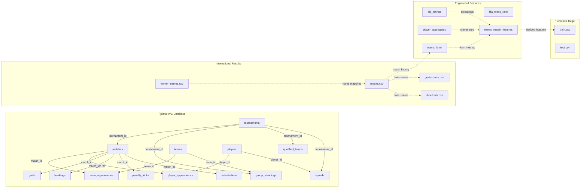

# 🔍 WorldCupAI — Complete Data Audit Report

> Full technical audit of every dataset: rows, columns, data types, memory usage, missing values, duplicate rows, candidate keys, leakage analysis, and relationship discovery.

---

## Audit Methodology

- **Tool:** Python 3 + pandas
- **Scope:** 113 CSV files discovered across the workspace via recursive scan
- **Hash:** MD5 checksums computed for every file to detect exact duplicates
- **Leakage detection:** Keyword-based column scanning + manual expert review
- **Date:** 2026-06-28

---

## 1. Dataset Summary Table

### Source 1 — FIFA World Cup Dataset (Root: `FIFA World Cup Dataset/`)

| File | Rows | Cols | Size (MB) | Memory (MB) | Missing | Dup Rows |
|------|------|------|-----------|-------------|---------|----------|
| `train.csv` | 192 | 24 | 0.02 | 0.04 | 32 | 0 |
| `test.csv` | 48 | 24 | 0.00 | 0.01 | 192 | 0 |

**Notes:**
- `test.csv` has 192 missing values — these are the 4 target columns (`winner`, `finalist`, `semi_finalist`, `quarter_finalist`) which are entirely NaN for the 2026 teams (48 teams × 4 columns = 192). This is **expected and correct**.
- `train.csv` has 32 missing values — 8 teams from 2022 have NaN in some target columns (teams that didn't reach specific stages).

---

### Source 2 — Fjelstul World Cup Historical Database (Root: `FIFA World Cup Historical Dataset/data-csv/`)

| File | Rows | Cols | Size (MB) | Missing | Candidate Primary Key |
|------|------|------|-----------|---------|----------------------|
| `tournaments.csv` | 30 | 18 | 0.00 | 0 | `tournament_id` |
| `matches.csv` | 1,248 | 37 | 0.29 | 0 | `match_id` |
| `team_appearances.csv` | 2,496 | 36 | 0.53 | 0 | — (composite: `match_id` + `team_id`) |
| `group_standings.csv` | 626 | 19 | 0.06 | 0 | — (composite: `tournament_id` + `team_id`) |
| `player_appearances.csv` | 27,432 | 21 | 4.46 | 0 | — (composite: `match_id` + `player_id`) |
| `players.csv` | 10,401 | 13 | 1.06 | 1 | `player_id` |
| `squads.csv` | 13,843 | 12 | 1.27 | 0 | — (composite) |
| `goals.csv` | 3,637 | 27 | 0.70 | 0 | `goal_id` |
| `bookings.csv` | 3,178 | 26 | 0.57 | 0 | `booking_id` |
| `penalty_kicks.csv` | 396 | 19 | 0.06 | 0 | `penalty_kick_id` |
| `substitutions.csv` | 10,222 | 24 | 1.79 | 0 | `substitution_id` |
| `qualified_teams.csv` | 625 | 8 | 0.04 | 0 | — (composite) |
| `teams.csv` | 88 | 14 | 0.02 | 0 | `team_id` |
| `confederations.csv` | 6 | 5 | 0.00 | 0 | `confederation_id` |
| `stadiums.csv` | 240 | 8 | 0.03 | 0 | `stadium_id` |
| `host_countries.csv` | 31 | 7 | 0.00 | 0 | — (composite) |
| `managers.csv` | 475 | 7 | 0.04 | 0 | `manager_id` |
| `manager_appearances.csv` | 2,538 | 17 | 0.37 | 0 | — (composite) |
| `manager_appointments.csv` | 637 | 10 | 0.05 | 0 | — (composite) |
| `referees.csv` | 493 | 10 | 0.06 | 0 | `referee_id` |
| `referee_appearances.csv` | 1,248 | 15 | 0.22 | 0 | — (composite) |
| `referee_appointments.csv` | 668 | 10 | 0.08 | 0 | — (composite) |
| `award_winners.csv` | 200 | 12 | 0.02 | 0 | `award_id` + `tournament_id` |
| `awards.csv` | 8 | 5 | 0.00 | 0 | `award_id` |
| `tournament_stages.csv` | 155 | 16 | 0.01 | 0 | — (composite) |
| `tournament_standings.csv` | 120 | 7 | 0.01 | 0 | — (composite) |
| `groups.csv` | 159 | 7 | 0.01 | 0 | `group_id` |

**Notes:**
- Zero missing values across 25 of 27 tables — exceptional data quality
- `players.csv` has 1 missing value (likely a birth_date)
- All tables have well-defined ID columns suitable as primary keys

---

### Source 3 — International Football Results (Root: `International football results from 1872 to 2026/`)

| File | Rows | Cols | Size (MB) | Missing | Candidate Primary Key |
|------|------|------|-----------|---------|----------------------|
| `results.csv` | 49,477 | 9 | 3.55 | 48 | — (composite: `date` + `home_team` + `away_team`) |
| `goalscorers.csv` | 47,747 | 8 | 3.11 | 298 | — (no natural key) |
| `shootouts.csv` | 678 | 5 | 0.03 | 422 | — (composite: `date` + `home_team` + `away_team`) |
| `former_names.csv` | 36 | 4 | 0.00 | 0 | `current` + `former` |

**Notes:**
- `results.csv` — 48 missing values are in `city`/`country` fields for very old matches
- `goalscorers.csv` — 298 missing likely in `minute` field for historic goals
- `shootouts.csv` — 422 missing in `first_shooter` (not recorded for all shootouts)

---

### Source 4 — Football Data from Transfermarkt (Root: `Football Data from Transfermarkt/`)

| File | Rows | Cols | Size (MB) | Missing | Notes |
|------|------|------|-----------|---------|-------|
| `appearances.csv` | 1,888,125 | 13 | 141.75 | 0 | **Largest dataset — 142 MB** |
| `game_lineups.csv` | 3,175,066 | 10 | 335.66 | 0 | **Largest dataset — 336 MB, 3.2M rows** |
| `game_events.csv` | 1,273,169 | 11 | 149.45 | 6,939 | 149 MB |
| `games.csv` | 88,872 | 23 | 25.07 | 81,621 | High missing count |
| `player_valuations.csv` | 662,998 | 6 | 30.78 | 98,277 | 15% missing |
| `players.csv` | 48,351 | 26 | 16.20 | 186,082 | ~14% missing across 26 cols |
| `transfers.csv` | 178,236 | 10 | 14.43 | 132,091 | 74% of rows have ≥1 missing |
| `club_games.csv` | 177,744 | 11 | 10.52 | 104,596 | 59% of rows have ≥1 missing |
| `clubs.csv` | 796 | 17 | 0.18 | 1,598 | ~12% missing |
| `national_teams.csv` | 124 | 17 | 0.03 | 137 | Moderate missing |
| `countries.csv` | 124 | 8 | 0.01 | 0 | Clean |
| `competitions.csv` | 65 | 11 | 0.01 | 39 | Clean |

**Notes:**
- Total Transfermarkt data: **~700 MB** across 12 files
- Very high missing value rates in `transfers.csv`, `club_games.csv`, `games.csv`
- `game_lineups.csv` and `appearances.csv` require chunked processing (too large for memory on constrained systems)

---

### Source 5 — Root-Level Engineered Datasets

| File | Rows | Cols | Size (MB) | Missing | Candidate Primary Key |
|------|------|------|-----------|---------|----------------------|
| `elo_ratings_wc2026.csv` | 4,683 | 23 | 0.44 | 0 | `year` + `country_code` |
| `fifa_mens_rank.csv` | 13,130 | 8 | 0.45 | 0 | `date` + `team` (approximate) |
| `player_aggregates.csv` | 1,599 | 13 | 0.18 | 96 | `country` + `fifa_version` |
| `teams_form.csv` | 102,094 | 5 | 3.12 | 0 | `team` + `match_date` |
| `teams_match_features.csv` | 43,364 | 35 | 13.09 | 4,494 | `_home_team` + `_away_team` + `_date` |

---

## 2. Duplicate File Analysis

**Method:** MD5 hash comparison across all 113 CSV files.

**Result:** **43 exact-duplicate file pairs** detected.

All duplicates are between `FIFA World Cup Historical Dataset/` and `worldcup-master/`. These two directories are identical copies of the same repository.

| Canonical Location | Duplicate Location | Files |
|---|---|---|
| `FIFA World Cup Historical Dataset/data-csv/*.csv` | `worldcup-master/data-csv/*.csv` | 27 pairs |
| `FIFA World Cup Historical Dataset/data-raw/**/*.csv` | `worldcup-master/data-raw/**/*.csv` | 12 pairs |
| `FIFA World Cup Historical Dataset/codebook/csv/*.csv` | `worldcup-master/codebook/csv/*.csv` | 2 pairs |
| **Total** | | **43 pairs** (100% byte-identical) |

### Recommendation

> **Use `FIFA World Cup Historical Dataset/data-csv/` as the canonical source.** Archive or delete `worldcup-master/`. No data loss occurs.

---

## 3. Data Leakage Analysis

### Classification Framework

| Level | Definition | Action |
|-------|-----------|--------|
| 🟢 **Allowed** | Pre-match data or data from prior tournaments/matches. Safe to use. | Use directly |
| 🟡 **Conditional** | Potentially safe if temporal filtering is applied correctly. Must only include data from **before** the match being predicted. | Use with temporal guard |
| 🔴 **Forbidden** | Post-match or same-tournament outcome data. Using these as features would cause data leakage. | Exclude from features; use as labels only |

### Detailed Leakage Classification

#### `train.csv` / `test.csv`

| Column | Classification | Rationale |
|--------|---------------|-----------|
| `version` | 🟢 Allowed | Tournament year identifier |
| `team`, `continent`, `is_host` | 🟢 Allowed | Static pre-tournament facts |
| `goals_scored_last_4y` | 🟢 Allowed | Rolling 4-year lookback window — pre-tournament |
| `goals_received_last_4y` | 🟢 Allowed | Same lookback logic |
| `wins_last_4y`, `losses_last_4y`, `draws_last_4y` | 🟢 Allowed | Pre-tournament rolling stats |
| `world_cup_titles_before` | 🟢 Allowed | Historical count (prior tournaments) |
| `squad_total_market_value_eur` | 🟢 Allowed | Pre-tournament snapshot |
| `fifa_rank_pre_tournament` | 🟢 Allowed | Pre-tournament FIFA rank |
| `fifa_points_pre_tournament` | 🟢 Allowed | Pre-tournament FIFA points |
| `squad_avg_age` | 🟢 Allowed | Pre-tournament squad stat |
| `world_cup_participations_before` | 🟢 Allowed | Historical count |
| `groups_passed_before` through `finals_before` | 🟢 Allowed | Prior tournament history |
| `winner` | 🔴 **Forbidden** | **TARGET VARIABLE** — tournament outcome |
| `finalist` | 🔴 **Forbidden** | **TARGET VARIABLE** — tournament outcome |
| `semi_finalist` | 🔴 **Forbidden** | **TARGET VARIABLE** — tournament outcome |
| `quarter_finalist` | 🔴 **Forbidden** | **TARGET VARIABLE** — tournament outcome |

#### `matches.csv` (Historical Database)

| Column | Classification | Rationale |
|--------|---------------|-----------|
| `tournament_id`, `match_id`, `match_date` | 🟢 Allowed | Identifiers/timestamps |
| `stage_name`, `group_name` | 🟢 Allowed | Tournament structure |
| `home_team_name`, `away_team_name` | 🟢 Allowed | Match setup |
| `stadium_name`, `city_name`, `country_name` | 🟢 Allowed | Venue (known pre-match) |
| `home_team_score`, `away_team_score` | 🔴 **Forbidden** | Same-match outcome |
| `score`, `score_penalties` | 🔴 **Forbidden** | Same-match outcome |
| `home_team_score_margin`, `away_team_score_margin` | 🔴 **Forbidden** | Same-match outcome |
| `extra_time`, `penalty_shootout` | 🔴 **Forbidden** | Same-match outcome |
| `result`, `home_team_win`, `away_team_win`, `draw` | 🔴 **Forbidden** | Same-match outcome |

#### `team_appearances.csv`

| Column | Classification | Rationale |
|--------|---------------|-----------|
| `goals_for`, `goals_against`, `goal_differential` | 🟡 **Conditional** | From prior matches: Allowed. From same match: Forbidden. |
| `result`, `win`, `draw` | 🟡 **Conditional** | Same temporal rule |
| `extra_time`, `penalty_shootout` | 🟡 **Conditional** | Same temporal rule |

#### `results.csv` (International Results)

| Column | Classification | Rationale |
|--------|---------------|-----------|
| `date`, `home_team`, `away_team` | 🟢 Allowed | Match identifiers |
| `tournament`, `city`, `country`, `neutral` | 🟢 Allowed | Context |
| `home_score`, `away_score` | 🟡 **Conditional** | Prior matches: Allowed for feature computation. Same match: Forbidden. |

#### `elo_ratings_wc2026.csv`

| Column | Classification | Rationale |
|--------|---------------|-----------|
| `year`, `country`, `country_code`, `confederation` | 🟢 Allowed | Identifiers |
| `rank`, `rating` (and variants) | 🟢 Allowed | Snapshot ratings — pre-computed for year-end |
| `wins`, `losses`, `draws`, `goals_for`, `goals_against` | 🟡 **Conditional** | Year-end aggregates — safe if from prior year to target tournament |
| `is_host` | 🟢 Allowed | Known pre-tournament |

#### `teams_match_features.csv`

| Column | Classification | Rationale |
|--------|---------------|-----------|
| `home_elo`, `away_elo`, `elo_diff` | 🟢 Allowed | Pre-match Elo snapshots |
| `home_avg_overall` through `away_avg_passing` | 🟢 Allowed | Player attribute aggregates (pre-match) |
| `overall_diff`, `attack_diff`, `defense_diff` | 🟢 Allowed | Derived from pre-match attributes |
| `home_form_scored`, `home_form_win_rate`, etc. | 🟡 **Conditional** | Must verify rolling window excludes target match |
| `is_neutral`, `is_world_cup`, `is_continental` | 🟢 Allowed | Known pre-match |
| `home_goals`, `away_goals` | 🔴 **Forbidden** | **LABELS** — the targets to predict |

#### `group_standings.csv`

| Column | Classification | Rationale |
|--------|---------------|-----------|
| `position`, `wins`, `draws`, `losses` | 🟡 **Conditional** | From prior tournaments: Allowed. From current tournament: Forbidden. |
| `goals_for`, `goals_against`, `goal_difference` | 🟡 **Conditional** | Same temporal rule |
| `points`, `advanced` | 🟡 **Conditional** | Same temporal rule |

#### `tournaments.csv`

| Column | Classification | Rationale |
|--------|---------------|-----------|
| `winner` | 🔴 **Forbidden** | Tournament winner — pure outcome data |

#### `tournament_standings.csv`

| Column | Classification | Rationale |
|--------|---------------|-----------|
| `position` | 🔴 **Forbidden** | Final standing — pure outcome data |

#### `qualified_teams.csv` / `host_countries.csv`

| Column | Classification | Rationale |
|--------|---------------|-----------|
| `performance` | 🔴 **Forbidden** | Post-tournament performance classification |

#### Player Position Columns (multiple datasets)

| Column | Classification | Rationale |
|--------|---------------|-----------|
| `position_name`, `position_code` | 🟢 Allowed | Player attribute — known pre-match |

#### Market Value Columns (Transfermarkt)

| Column | Classification | Rationale |
|--------|---------------|-----------|
| `market_value_in_eur`, `total_market_value` | 🟡 **Conditional** | Safe if snapshot date is pre-tournament |

---

## 4. Relationship Discovery

### Entity Mapping via Shared Keys

### Key Join Paths

| From | To | Join Key(s) | Notes |
|------|----|-------------|-------|
| `train/test.csv` | `elo_ratings` | `team` ↔ `country` (name-based) | Requires name harmonization |
| `train/test.csv` | `fifa_mens_rank` | `team` ↔ `team` | Direct name match (verify) |
| `train/test.csv` | `player_aggregates` | `team` ↔ `country` | Name-based |
| `teams_match_features` | `results.csv` | `_home_team`+`_away_team`+`_date` ↔ `home_team`+`away_team`+`date` | Exact match |
| `teams_match_features` | `elo_ratings` | team+year ↔ country+year | Name harmonization needed |
| `matches.csv` (Historical) | `team_appearances` | `match_id` | Direct FK |
| `matches.csv` (Historical) | `player_appearances` | `match_id` | Direct FK |
| `matches.csv` (Historical) | `results.csv` | team names + date | Cross-source; name harmonization needed |
| `squads.csv` | `players.csv` | `player_id` | Direct FK |
| `teams.csv` (Historical) | Most Historical tables | `team_id` | Direct FK |
| `Transfermarkt players` | `player_appearances` (Historical) | Player name matching | Fuzzy match required — no shared ID |

### Team Name Harmonization Challenge

Different datasets use different naming conventions:

| Entity | `train.csv` | `results.csv` | `elo_ratings` | `Historical DB` | `Transfermarkt` |
|--------|------------|---------------|---------------|-----------------|-----------------|
| USA | United States | United States | USA | USA | United States |
| South Korea | South Korea | South Korea | South Korea | Korea Republic | South Korea |
| China | China PR | China PR | China | China PR | China |

> **Action Required (Phase 2):** Build a comprehensive team name mapping table covering all naming variants across all data sources.

---

## 5. Data Type Summary

### Type Distribution Across All Datasets

| Data Type | Count (across all columns) | Common In |
|-----------|---------------------------|-----------|
| `object` (string) | ~320 columns | Names, codes, dates (as text), URLs |
| `int64` | ~250 columns | Counts, IDs, flags, scores |
| `float64` | ~180 columns | Ratings, percentages, averages |
| `bool` | ~10 columns | Binary flags |

### Date Handling Alert

> Multiple date formats detected:
> - `YYYY-MM-DD` (ISO format) — `results.csv`, `matches.csv`
> - `YYYY` (year only) — `elo_ratings`, `train.csv` (`version` column)
> - `YYYY,S` (year + semester) — `fifa_mens_rank.csv`
> 
> **Phase 2 Action:** Standardize all date columns to ISO 8601 (`YYYY-MM-DD`) during data cleaning.

---

## 6. Missing Value Hotspots

| Dataset | Missing Count | Missing % | Priority Columns |
|---------|--------------|-----------|-----------------|
| `players.csv` (Transfermarkt) | 186,082 | ~14% | `market_value`, `height`, `foot` |
| `transfers.csv` | 132,091 | ~74% per row | `transfer_fee`, `market_value` |
| `club_games.csv` | 104,596 | ~59% per row | `own_position`, `opponent_position` |
| `player_valuations.csv` | 98,277 | ~15% | `market_value_in_eur` |
| `games.csv` (Transfermarkt) | 81,621 | ~40% | `attendance`, `home/away_club_position` |
| `teams_match_features.csv` | 4,494 | ~0.3% | Various feature columns |
| `test.csv` | 192 | 100% of targets | `winner`, `finalist`, etc. (expected) |

---

*Audit generated by WorldCupAI Phase 1 automated profiler — 2026-06-28*
